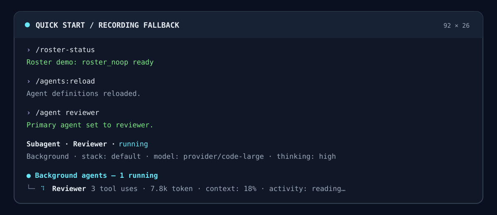
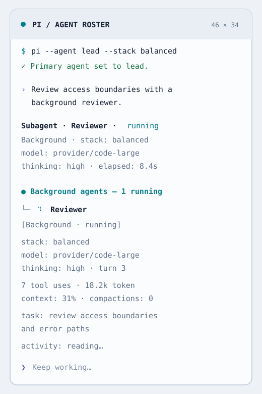

# pi-agent-roster

Primary-agent profiles and in-process subagent orchestration for Pi. Define a roster in Markdown; select profiles and model stacks; then delegate foreground or background work without leaving the parent TUI.

<picture>
  <source media="(prefers-color-scheme: dark)" srcset="./media/terminal-dark.svg">
  
</picture>

> **Release status:** this package is currently unreleased at `0.0.0`. See [Compatibility and publication](#compatibility-and-publication) before relying on an install path.

## Installation

Requirements: Node `>=22.22.2`, Pi `>=0.84.3 <0.85.0`, and authentication for every model named by a selected profile or stack.

From this source checkout, install workspace dependencies and register the local package:

```sh
npm ci
pi install ./packages/pi-agent-roster
```

For a single run without changing Pi's saved package list, use `pi -e ./packages/pi-agent-roster` instead.

There is no npm install command yet because no npm release exists.

Pi packages execute with full system access. Review the extension and any child-loaded extensions before enabling them.

## Quick Start: the roster is empty by default

The package intentionally ships **no built-in agents**. On a fresh install, `/roster-status` confirms that the extension loaded, but delegation tools stay hidden until at least one enabled `subagent` or `all` profile exists.

1. Save this as `.pi/agents/reviewer.md` before starting Pi:

   ```markdown
   ---
   display_name: Reviewer
   description: Reviews a focused change for correctness and missed edge cases
   mode: subagent
   tools: [read, grep, find]
   max_turns: 12
   grace_turns: 2
   ---

   Review only the requested change. Cite concrete files and distinguish defects
   from optional improvements.
   ```

2. Start Pi and verify the extension:

   ```text
   /roster-status
   ```

3. Ask Pi to use the `reviewer` subagent and include the complete task, paths, constraints, and expected output. The child receives no parent conversation.

If Pi was already running when the file changed, use `/agents:reload`. Restarting also rebuilds the model-facing tool description, which is useful after adding the first agent.

[View the sanitized terminal recording source](./media/quick-start.cast), or use its deterministic fallback:

[](./media/quick-start.cast)

## Agent definitions

Agent identity comes from the Markdown filename and is case-insensitive. Definitions are discovered in this order:

1. `$PI_CODING_AGENT_DIR/agents/*.md` — global; the directory defaults to `~/.pi/agent/agents`.
2. `<project>/.pi/agents/*.md` — project; wins over a global file with the same identity.

An invalid project override still masks the global definition. Files are scanned in lexical order, one bad file does not stop the rest, and diagnostics are written with the source path. Duplicate names that differ only by case are rejected within a layer.

### Frontmatter reference

| Field | Meaning | Default |
| --- | --- | --- |
| `display_name` | Label shown in pickers, rows, widgets, and reports. | Filename |
| `description` | Short purpose shown to the model and in the TUI. | Filename |
| `mode` | `primary`, `subagent`, or `all`. | `subagent` |
| `enabled` | Keeps a definition discoverable but unavailable when `false`. | `true` |
| `allowed_agents` | Case-insensitive delegation allowlist used when this profile is the selected primary. `[]` denies all; omission is unrestricted. | Unrestricted |
| `tools` | Tool allowlist. Accepts a comma-separated string or YAML sequence; `none` means no tools. Extension tools must be registered in the child. | `read`, `bash`, `edit`, `write`, `grep`, `find`, `ls` |
| `model` | Exact `provider/model` or fuzzy available-model name. | Active parent model |
| `thinking` | `minimal`, `low`, `medium`, `high`, `xhigh`, or `max`. | Active parent level |
| `stacks` | Named model/thinking profiles. Stack models must use `provider/model` format. | None |
| `default_stack` | Named stack or the synthetic `default`. | `default` |
| `max_turns` | Soft turn limit, `1–10000`; legacy `0` means unlimited. | Project/global setting |
| `grace_turns` | Turns allowed after the wrap-up request, `0–1000`. | Project/global setting |
| `run_in_background` | When present, forces tool launches for this agent into that mode; otherwise the call chooses. | Foreground |
| `prompt_mode` | `append` or `replace`. | `append` |

The Markdown body is the profile's system instruction. For a primary, `append` adds it to Pi's session-start prompt and `replace` replaces that prompt. For a child, the body is combined with a roster-owned runtime baseline containing only the explicit child role and sanitized environment facts; `replace` omits the optional child-guidance block but not that runtime baseline.

`inherit_context` and `model_stacks` are unsupported and reject the file. Children never inherit the parent conversation.

### Primary and child example

A primary that may delegate must include the managed tools in its own `tools` allowlist:

```markdown
---
display_name: Lead
description: Coordinates implementation and review
mode: primary
allowed_agents: [reviewer, tests]
tools: [read, grep, find, subagent, get_subagent_result, steer_subagent]
default_stack: balanced
stacks:
  fast:
    model: provider/code-small
    thinking: low
  balanced:
    model: provider/code-large
    thinking: high
---

Split independent work, give each child a self-contained task, and synthesize the results.
```

Replace the example model IDs with authenticated models available to Pi. A child profile does not need to list the three managed tools; they are denied inside children as a recursion guard.

## Stacks, precedence, and reload

Every agent has a synthetic `default` stack. It uses the agent's `model` and `thinking` when present, otherwise the model and thinking level captured from Pi at session start. Named stacks override those values.

Stack selection precedence is:

1. Explicit `stack` on a tool or service request, or `--stack` at startup.
2. Session-local override from `/stack`.
3. The agent's `default_stack`.
4. Synthetic `default`.

Within the selected profile, one-off `model` and `thinking` tool arguments win, then named-stack values, then agent fields, then the captured Pi baseline. Thinking is clamped to a level the selected model supports, preferring the nearest lower level and otherwise the model's lowest supported level. Only authenticated models in Pi's available-model registry can resolve.

Useful commands:

```text
/stack reviewer fast       # set a session-local override
/stack reviewer default    # force the synthetic default
/stack reviewer auto       # clear the session-local override
/agents:reload             # rescan definitions and reapply the selected primary
```

Names are case-insensitive. A stale session override falls back to the configured default with a warning. Overrides reset at the next Pi session start. `/agents:reload` waits for the parent to become idle; if the current primary disappeared or became ineligible, it restores Pi's default profile.

Definitions are also refreshed immediately before delegation, so removed, disabled, or newly unauthorized targets cannot enter the queue.

## Startup flags, authentication, and reset

```sh
pi --agent lead --stack balanced
pi --roster-name demo
```

- `--agent <name>` selects an enabled `primary` or `all` profile at session start.
- `--stack <name>` requires a non-default `--agent`; it cannot select a stack by itself.
- `--roster-name <name>` labels the diagnostic instance reported by `/roster-status`; its default is `default`.

Authenticate models through Pi (for example, `/login`) before selecting a profile. A missing model or unavailable authentication produces an error and preserves the current model, thinking level, prompt, and tools.

Use `/agent` for the interactive profile picker, `/agent <name>` for direct selection, and `/agent default` to restore the model, thinking level, prompt, and tools captured at session start. Resetting does not switch or fork the Pi session. Profile changes wait until the parent is idle.

## Orchestration and child lifecycle

The `subagent` tool runs a child as a Pi `AgentSession` in the same process.

- **Foreground** calls start immediately, bypass the background queue, stream an inline status row, and return the final text.
- **Background** calls return an ID immediately. A FIFO limiter admits four by default; excess work remains visibly queued.
- **Steering** reaches a running child after its current tool execution. Messages sent before session creation are buffered.
- **Collection** through `get_subagent_result` can poll or wait. Collecting a settled result suppresses duplicate completion nudges.
- **Resume** re-prompts only that child's own history. A released live session is reconstructed from its persisted child transcript.

A finite `max_turns` first sends a wrap-up message. `grace_turns` controls how many additional turns are allowed before a hard abort; an unlimited grace period never hard-aborts for the soft limit. Invocation values override agent values, which override project/global defaults.

Background and queued children are aborted when the parent is interrupted with `Esc` by default. Foreground children hold the parent run signal and always stop with it. The policy is configurable in `/subagents:settings`.

Each child:

1. Optionally prepares a workspace.
2. Creates its own persisted JSONL session and parent-session lineage.
3. Loads child extensions, validates configured tools, emits `session_start`, and runs the task.
4. Emits completion data and retains the result record.
5. On release or shutdown, emits child `session_shutdown` before disposal; handlers are bounded to five seconds so Pi can still exit.

Child sessions live beside the parent transcript under `<parent-session>/tasks/`. Headless parents use a temporary, project-keyed directory. Consumed live sessions are released after 10 minutes by default; unconsumed sessions use a 12-hour safety cap. Lightweight records and transcript pointers remain available for the parent session. Settled records are cleared on session start or switch, and shutdown aborts and disposes all remaining work.

The extension emits high-level `subagents:created`, `started`, `completed`, `failed`, `resumed`, `compacted`, and `steered` events, plus ordered `subagents:child:*` session lifecycle events for synchronous observers.

## Tools

| Tool | Purpose | Important inputs |
| --- | --- | --- |
| `subagent` | Spawn or resume a child. Foreground waits; background returns an ID. | `task`, `subagent_type`, `description`, `stack`, `model`, `thinking`, `max_turns`, `grace_turns`, `run_in_background`, `resume` |
| `get_subagent_result` | Inspect, wait for, and collect a background result. | `agent_id`, `wait`, `verbose` |
| `steer_subagent` | Add an explicit mid-run message to a running child. | `agent_id`, `steering` |
| `roster_noop` | Confirm the baseline tool runtime without changing state. | Optional `note`, returned unchanged |

The three managed subagent tools are visible only when at least one enabled, authorized child target exists. Tasks and steering text must be non-empty. New tasks and resume tasks must be self-contained.

## Extension service

The package root exports a typed cross-extension service:

```ts
import { getSubagentsService } from "pi-agent-roster";

const service = getSubagentsService();
if (!service) throw new Error("pi-agent-roster is not active");

const id = service.spawn({
  type: "reviewer",
  task: "Review src/policy.ts and report concrete defects with line references.",
  stack: "fast",
});

const result = service.inspect(id);
```

`getSubagentsService()` returns `undefined` before the extension publishes at startup and after session shutdown. The service provides:

- `spawn`, `resume`, `inspect`, `listAgents`, `abort`, and `steer`
- `waitForAll` and `hasRunning`
- `registerWorkspaceProvider`, returning a disposer

Service spawns are background by default. `foreground: true` starts immediately but still returns an ID synchronously; callers can inspect or await through the service. `bypassQueue` is intended for integrations that must start immediately.

`SUBAGENT_EVENTS` exports the high-level event channel names. `SubagentRecord` includes status, invocation, usage, context, compaction, conversation, result/error, and transcript metadata.

Only one `WorkspaceProvider` can be registered. Its `prepare()` method may return a worktree, container mount, temporary directory, or remote workspace; its `dispose()` result can append provider-owned text to the child result.

## Settings

Settings are loaded shallowly with project values winning:

1. `$PI_CODING_AGENT_DIR/agent-roster.json` — global defaults, never written by the extension.
2. `<project>/.pi/agent-roster.json` — project overrides written by `/subagents:settings`.

| Setting | Default | Accepted values |
| --- | ---: | --- |
| `maxConcurrent` | `4` | Integer `1–1024` |
| `defaultMaxTurns` | Unlimited | Integer `1–10000`; `0` is normalized to unlimited |
| `graceTurns` | Unlimited | Integer `0–1000` |
| `consumedSessionRetentionMinutes` | `10` | Integer `1–20160` |
| `unconsumedSessionRetentionMinutes` | `720` | Integer `1–20160` |
| `abortAllOnInterrupt` | `true` | Boolean |
| `excludedExtensionPackages` | `[]` | Exact Pi package-source strings; manual JSON edit only |

Open `/subagents:settings` to edit the merged current values into the project layer; the global file remains read-only. The exclusion list deliberately has no picker, and an unrelated settings edit preserves a hand-written list.

```json
{
  "maxConcurrent": 3,
  "defaultMaxTurns": 24,
  "graceTurns": 2,
  "consumedSessionRetentionMinutes": 15,
  "unconsumedSessionRetentionMinutes": 720,
  "abortAllOnInterrupt": true,
  "excludedExtensionPackages": ["npm:example-child-tools"]
}
```

An excluded package's extensions are prevented from loading in child sessions by exact source-string match; the user's parent settings are not modified. Malformed files and invalid or unknown fields warn and are ignored field-by-field where possible. Restart Pi after hand-editing settings; interactive changes apply immediately and are persisted to the project file.

The exported `pi-agent-roster/settings` entry point also provides the generic typed `loadLayeredSettings()` helper for other extensions.

## TUI, `Ctrl+O`, and session viewer

The UI is designed to stay useful at both wide and narrow terminal widths:

- Foreground children update their native tool row in place.
- Background children appear in an above-editor tree with state, stack, model, thinking, turns, usage, context fill, compactions, task, and current activity. The tree is capped and summarizes hidden rows.
- Pi's default `Ctrl+O` binding (`app.tools.expand`) expands or collapses tool output. An expanded subagent row includes task and session IDs, timing, budgets, activity history, and current/final output, with a pointer to the full transcript viewer.
- `/subagents:sessions` opens a searchable picker followed by a read-only overlay. Live sessions stream; released sessions load their JSONL snapshot.

Viewer controls are `↑`/`↓` or `j`/`k`, `PgUp`/`PgDn`, `Home`/`End`, and `q`, `Esc`, or `Ctrl+C` to close. Footer hints shorten at narrow widths.

<details>
<summary>Narrow-terminal variant</summary>

<picture>
  <source media="(prefers-color-scheme: dark)" srcset="./media/terminal-narrow-dark.svg">
  
</picture>

</details>

## Isolation and security model

Isolation is explicit rather than implied:

- **Conversation:** a child receives no parent messages. `inherit_context` and service equivalents are rejected. Resume sees only the child's transcript plus the new task.
- **Prompt/resources:** child context files, prompt templates, and themes are disabled. The selected agent body, child role, working directory, platform, and Git state form the system prompt.
- **Tools:** each profile is an allowlist. Child-loaded extensions may add named tools, but `subagent`, `get_subagent_result`, and `steer_subagent` are always denied to prevent recursive orchestration.
- **Sessions:** every child has its own ID, JSONL transcript, lifecycle, usage accounting, and bounded shutdown.
- **Filesystem:** there is **no filesystem isolation by default**. Children use the parent working directory and run in the same process with the privileges of loaded extensions. Register a `WorkspaceProvider` when worktree, container, temporary-directory, or remote isolation is required.
- **Packages:** `excludedExtensionPackages` can prevent selected package extensions from loading in children without rewriting Pi's real settings.

Do not put secrets or assumptions from the parent chat into agent definitions. Pass only the minimum task context a child needs, and treat child extensions as trusted code.

## Troubleshooting

| Symptom | Check |
| --- | --- |
| No agents or managed tools appear | The empty default is intentional. Add an enabled `mode: subagent` or `mode: all` definition, reload, and restart if the tool catalog needs rebuilding. |
| A project agent does not fall back to the global one | Project identity wins even when invalid. Fix or remove the project file and read the `[pi-agent-roster]` diagnostic. |
| A primary cannot delegate | Include the managed tools in its `tools` allowlist and ensure `allowed_agents` admits at least one enabled child profile. |
| “Model not found” or authentication error | Use `/login`, confirm the model is in Pi's available registry, and use `provider/model` for named stack entries. Failed selection preserves the current profile. |
| A stack disappeared | Run `/stack <agent> auto` to clear the override, or choose `default`; stale overrides otherwise fall back with a warning. |
| “Unknown child tools” | The name in `tools` must be built in or registered by an extension that the child actually loads. Check Pi package filters and `excludedExtensionPackages`. |
| Background work stopped on `Esc` | `abortAllOnInterrupt` defaults to `true`. Toggle it in `/subagents:settings`; foreground work still follows the parent interrupt. |
| The child seems unaware of the conversation | This is required isolation. Repeat every necessary fact, path, constraint, and output expectation in `task`. |
| `/subagents:sessions` is empty | Queued work has no child session yet. Only records with a live session or persisted transcript are listed. |
| A result can no longer resume live | The retention sweep may have released the heavy session; resume reconstructs from the child transcript while its record remains available. |
| Installed CLI behavior differs | Confirm Pi `0.84.x`, Node `>=22.22.2`, public-root imports, and the exact installed-tarball smoke described below. |

For a lightweight load check, run `/roster-status`. A healthy response is `Roster <name>: roster_noop ready`.

## Compatibility and publication

The peer range is Pi `>=0.84.3 <0.85.0`; development and installed-package verification use exactly `0.84.3`. Extension code imports only public roots from `@earendil-works/pi-coding-agent`, `@earendil-works/pi-ai`, and `@earendil-works/pi-tui`.

**No npm release exists.** The release workflow is manually gated and requires the exact-version npm CLI smoke. Do not substitute an unbundled development entrypoint to conceal a failure, and do not widen the peer range until the peer floor and installed-CLI evidence are updated together.

```sh
npm run smoke:installed
```

The smoke packs the tarball, installs it with exact peers into a fresh tree, launches the actual npm Pi CLI with a fresh Pi home, and verifies flags, commands, tools, foreground/background execution, delayed admission, workspace integration, steering, retained and reconstructed resume, transcript isolation, lifecycle events, retention, and shutdown without network credentials.

## Provenance

This package adapts the in-process subagent implementation from `@gotgenes/pi-subagents@19.3.5`, itself a friendly fork of `@tintinweb/pi-subagents`. `pi-open-agents@0.1.17` is a semantic reference, not a copied-code source.

Pinned commits, authors, licenses, retained notices, and path-level source mappings are recorded in [`THIRD_PARTY_NOTICES.md`](./THIRD_PARTY_NOTICES.md). The terminal media in [`media/`](./media/) was created for this package from sanitized fictional output; no upstream artwork or user environment was copied.

## License

[MIT](./LICENSE) © 2026 Christopher Tam. Third-party adaptations remain subject to their retained MIT notices.
