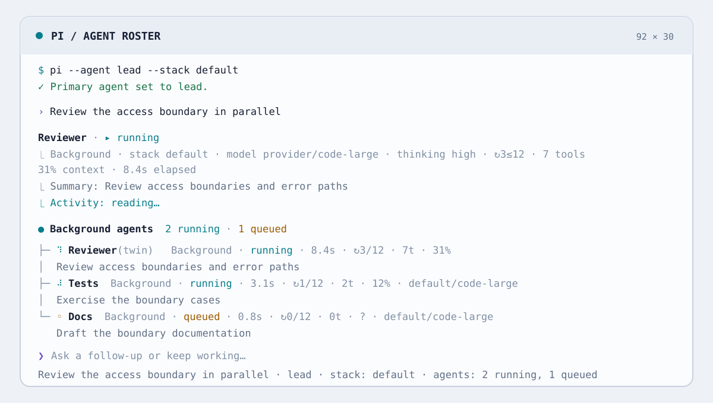

# pi-agent-roster

Primary-agent profiles and in-process subagent orchestration for Pi. Define a roster in Markdown. Named stacks are reusable model/thinking presets that let you switch between authenticated models without editing agent definitions. Delegate foreground or background work without leaving the parent TUI.

<picture>
  <source media="(prefers-color-scheme: dark)" srcset="./media/terminal-dark.svg">
  
</picture>

## Installation

Requirements: Node `>=22.22.2`, Pi `>=0.84.3 <0.85.0`, and authentication for every model named by a selected profile or stack.

For a persistent installation:

```sh
pi install npm:pi-agent-roster@alpha
```

For a single run without changing Pi's saved package list:

```sh
pi -e npm:pi-agent-roster@alpha
```

Pi packages execute with full system access. Review the extension and any child-loaded extensions before enabling them.

## Quick Start: the roster is empty by default

The package intentionally ships **no built-in agents**. Delegation tools stay hidden until at least one enabled `subagent` or `all` profile exists.

1. Save this as `.pi/agents/reviewer.md` before starting Pi:

   ```markdown
   ---
   display_name: Reviewer
   description: Reviews a focused change for correctness and missed edge cases
   mode: subagent
   permission:
     "*": deny
     read: allow
     grep: allow
     find: allow
   context_files: false
   max_turns: 12
   grace_turns: 2
   ---

   Review only the requested change. Cite concrete files and distinguish defects
   from optional improvements.
   ```

2. Start Pi:

   ```sh
   pi
   ```

3. Ask Pi to use the `reviewer` subagent and include the complete task, paths, constraints, and expected output. The child receives no parent conversation.

If Pi was already running when the file changed, use `/agents:reload`. Restarting also rebuilds the model-facing tool description, which is useful after adding the first agent.

## Agent definitions

Agent identity comes from the Markdown filename and is case-insensitive. Definitions are discovered in this order:

1. `$PI_CODING_AGENT_DIR/agents/*.md` — global; the directory defaults to `~/.pi/agent/agents`.
2. `<project>/.pi/agents/*.md` — project; wins over a global file with the same identity.

An invalid project override still masks the global definition. Files are scanned in lexical order, one bad file does not stop the rest, and diagnostics are written with the source path. Duplicate names that differ only by case are rejected within a layer.

### Frontmatter reference

| Field | Meaning | Default |
| --- | --- | --- |
| `display_name` | Label shown in pickers, rows, widgets, reports, and the selected-primary footer status. | Filename |
| `description` | Short purpose shown to the model and in the TUI. | Filename |
| `mode` | `primary`, `subagent`, or `all`. | `subagent` |
| `enabled` | Keeps a definition discoverable but unavailable when `false`. | `true` |
| `allowed_agents` | Case-insensitive delegation allowlist used when this profile is the selected primary. `[]` denies all; omission is unrestricted. | Unrestricted |
| `permission` | Flat mapping from exact tool names, or `*`, to lowercase `allow` or `deny`. | All available tools allowed |
| `context_files` | Whether child sessions discover and append the normal `AGENTS.md`/`CLAUDE.md` hierarchy. It has no effect on primary prompt assembly. | `true` |
| `model` | Exact `provider/model` or fuzzy available-model name. | Active parent model |
| `thinking` | `minimal`, `low`, `medium`, `high`, `xhigh`, or `max`. | Active parent level |
| `stacks` | Named model/thinking profiles. Stack models must use `provider/model` format. Name the go-to profile `default` to select it automatically. | None |
| `default_stack` | Optional name of a different stack to select automatically. | `default` |
| `max_turns` | Soft turn limit, `1–10000`; `0` also means unlimited. | Project/global setting |
| `grace_turns` | Turns allowed after the wrap-up request, `0–1000`. | Project/global setting |
| `run_in_background` | When present, forces tool launches for this agent into that mode; otherwise the call chooses. | Foreground |
| `prompt_mode` | `append` or `replace`. | `append` |

The Markdown body is the profile's system instruction. There are exactly two prompt modes:

- **Primary `append`:** Pi's system prompt, already assembled when roster selection begins, followed by the profile body.
- **Primary `replace`:** the profile body replaces that captured Pi prompt.
- **Child `append`:** roster's isolated-child runtime baseline, tool-aware operational guidance, active-agent and environment facts, then the wrapped profile body.
- **Child `replace`:** the profile body only. It replaces every roster-owned child baseline, guidance, and metadata block.

#### Tool permissions

`permission` is a flat mapping from exact tool names to lowercase `allow` or `deny`; `*` is the fallback. Nested mappings, arrays, `ask`, paths, command/file patterns, and globs such as `ba*` remain invalid. An omitted mapping or omitted `*` defaults to allow, and exact names override `*` regardless of YAML order. Permissions resolve against the current primary registered tools, or a child's built-ins plus child-extension tools; unknown exact names are rejected. Managed delegation tools are still stripped from children.

For child `append` prompts, built-in operational guidance is added only for enabled `read`, `edit`, `write`, `find`, and `grep` tools. `replace` omits roster-owned guidance; tool descriptions themselves are unchanged.

#### Context files

`context_files` is a boolean profile frontmatter parameter that defaults to `true`. It may appear on any profile, but only child execution reads it: normal `AGENTS.md`/`CLAUDE.md` discovery applies in both `append` and `replace` modes, and `false` disables it. Child execution does not inherit the parent conversation or other prompt resources, and this setting cannot alter the already assembled primary prompt. Children never use Pi's built-in default system prompt.

### Primary and child example

A primary may delegate whenever its permissions do not deny the managed tools and `allowed_agents` admits a child:

```markdown
---
display_name: Lead
description: Coordinates implementation and review
mode: primary
allowed_agents: [reviewer, tests]
permission:
  bash: deny
stacks:
  fast:
    model: provider/code-small
    thinking: low
  default:
    model: provider/code-large
    thinking: high
---

Split independent work, give each child a self-contained task, and synthesize the results.
```

The three managed delegation tools are always excluded inside children as a recursion guard, even if child permissions would otherwise allow them.

## Stacks, precedence, and reload

The preceding example defines model/thinking combinations once under `stacks`. The stack named `default` is the go-to and is selected automatically; switch among authenticated `provider/model` values available to Pi without editing the agent definition. Use `default_stack` only when another named stack should be selected automatically instead.

Every agent has a `default` selection. When `stacks.default` exists, its model and thinking values are used. Otherwise `default` is a synthetic fallback that uses the agent's `model` and `thinking` when present, then the model and thinking level captured from Pi at session start. Other named stacks override those fallback values in the same way.

Stack selection precedence is:

1. Explicit `stack` on a tool or service request, or `--stack` at startup.
2. Session-local override from `/stack`.
3. The agent's `default_stack`, when configured.
4. The named `stacks.default` profile, or the synthetic `default` fallback when that profile is absent.

When a roster primary is active, its selected stack **name** propagates to every new or resumed subagent. If the child defines a case-insensitively matching stack, the child uses that profile's model and thinking configuration. If it does not, the child falls back to the primary stack's resolved model and thinking level. Child `stack`, `model`, and `thinking` invocation arguments are rejected in this mode, so callers do not need to pass `stack` when delegating.

When Pi's default primary is active, children continue to resolve independently: one-off `model` and `thinking` arguments win, then the child's named-stack values, then child agent fields, then the captured Pi baseline. Thinking is clamped to a level the selected model supports, preferring the nearest lower level and otherwise the model's lowest supported level. Only authenticated models in Pi's available-model registry can resolve.

Useful commands:

```text
/agent                     # choose a primary profile
/agent lead                # select a primary directly (case-insensitive)
/agent default             # restore Pi's captured startup state
/stack                     # choose a stack for the active roster primary
/stack lead fast           # set a session-local override directly
/stack lead default        # force the named default, or synthetic fallback
/stack lead auto           # clear the override; resume configured selection
/agents:reload             # rescan definitions and reapply the selected primary
```

With a roster primary active, `/stack` opens that primary's stack picker directly; it never opens an agent picker. Without an active roster primary it asks you to select one with `/agent`. The explicit `/stack <agent> <stack>` form remains available, including for child overrides while Pi's default primary is active. Command completion lists matching agents first and that agent's `auto`, `default`, and named stacks second. When a roster primary is active, completion and explicit stack changes are restricted to that primary because child stack overrides are disabled.

Names are case-insensitive. A stale session override falls back to the configured default with a warning. Overrides reset at the next Pi session start. `/agents:reload` waits for the parent to become idle; if the current primary disappeared or became ineligible, it restores Pi's default profile.

Definitions are also refreshed immediately before delegation, so removed, disabled, or newly unauthorized targets cannot enter the queue.

## Startup flags, authentication, and reset

```sh
pi --agent lead --stack default
```

- `--agent <name>` selects an enabled `primary` or `all` profile at session start.
- `--stack <name>` requires a non-default `--agent`; it cannot select a stack by itself.

Authenticate models through Pi (for example, `/login`) before selecting a profile. A missing model or unavailable authentication produces an error and preserves the current model, thinking level, prompt, and tools.

Use `/agent` for the interactive profile picker, `/agent <name>` for direct selection, and `/agent default` to restore the model, thinking level, prompt, and tools captured at session start. A selected profile appears in the one-line footer status as `Primary: <display_name> · stack: <effective_stack_name>`; restoring Pi's default removes this status. The stack name is the effective resolved profile, including `default` when the synthetic fallback is in use. Resetting does not switch or fork the Pi session. Profile and stack changes wait until the parent is idle.

`Ctrl+Alt+A` opens the `/agent` selector and `Ctrl+Alt+S` opens `/stack` for the active primary. These shortcuts dispatch only while the parent is idle; while an agent run is active they show a warning instead of queueing a selection command.

## Orchestration and child lifecycle

The `subagent` tool runs a child as a Pi `AgentSession` in the same process.

- **Foreground** calls start immediately, bypass the background queue, stream an inline status row, and return the final text.
- **Background** calls return an ID immediately. A FIFO limiter admits four by default; excess work remains visibly queued.
- **Steering** reaches a running child after its current tool execution. Messages sent before session creation are buffered.
- **Collection** through `get_subagent_result` can poll or wait. Collecting a settled result suppresses duplicate completion nudges.
- **Resume** re-prompts only that child's own history. A released live session is reconstructed from its persisted child transcript.

A finite `max_turns` first sends a wrap-up message. `grace_turns` controls how many additional turns are allowed before a hard abort; an unlimited grace period never hard-aborts for the soft limit. Invocation values override agent values, which override project/global defaults.

Background and queued children are aborted when the parent is interrupted with `Esc` by default. Foreground children hold the parent run signal and always stop with it. The policy is configurable in `/subagents:settings`.

Child sessions live beside the parent transcript under `<parent-session>/tasks/`. Headless parents use a temporary, project-keyed directory. Each child emits `session_shutdown` before release or shutdown disposal; handlers are bounded to five seconds so Pi can still exit. Consumed live sessions are released after 10 minutes by default; unconsumed sessions use a 12-hour safety cap. Lightweight records and transcript pointers remain available for the parent session. Settled records are cleared on session start or switch, and shutdown aborts and disposes all remaining work.

## Tools

| Tool | Purpose | Important inputs |
| --- | --- | --- |
| `subagent` | Spawn or resume a child. Foreground waits; background returns an ID. A roster primary propagates its stack name; a matching child stack wins, otherwise the primary resolution is used. | `task`, `subagent_type`, `description`, `stack`, `model`, `thinking`, `max_turns`, `grace_turns`, `run_in_background`, `resume`; stack/model/thinking overrides require Pi's default primary |
| `get_subagent_result` | Inspect, wait for, and collect a background result. | `agent_id`, `wait`, `verbose` |
| `steer_subagent` | Add an explicit mid-run message to a running child. | `agent_id`, `steering` |

The three managed subagent tools are visible only when at least one enabled, authorized child target exists. Tasks and steering text must be non-empty. New tasks and resume tasks must be self-contained.

## Extension service

The package root exports a typed cross-extension service:

```ts
import { getSubagentsService } from "pi-agent-roster";

const service = getSubagentsService();
if (!service) throw new Error("pi-agent-roster is not active");

const id = service.spawn({
  type: "reviewer",
  task: "Review src/policy.ts and report concrete defects with line references.",
  stack: "fast",
});

const result = service.inspect(id);
```

`getSubagentsService()` returns `undefined` before the extension publishes at startup and after session shutdown. The service provides:

- `spawn`, `resume`, `inspect`, `listAgents`, `abort`, and `steer`
- `waitForAll` and `hasRunning`
- `registerWorkspaceProvider`, returning a disposer

Service spawns are background by default. `foreground: true` starts immediately but still returns an ID synchronously; callers can inspect or await through the service. `bypassQueue` is intended for integrations that must start immediately. As with tool launches, an active roster primary propagates its stack name, uses a matching child stack when present, falls back to the primary resolution otherwise, and rejects a service request's child `stack` override.

`SUBAGENT_EVENTS` exports the high-level event channel names: `subagents:created`, `started`, `completed`, `failed`, `resumed`, `compacted`, and `steered`. Ordered `subagents:child:*` session lifecycle events are also emitted for synchronous observers. `SubagentRecord` includes status, invocation, usage, context, compaction, conversation, result/error, and transcript metadata.

Only one `WorkspaceProvider` can be registered. Its `prepare()` method may return a worktree, container mount, temporary directory, or remote workspace; its `dispose()` result can append provider-owned text to the child result.

## Settings

Settings are loaded shallowly with project values winning:

1. `$PI_CODING_AGENT_DIR/agent-roster.json` — global defaults, never written by the extension.
2. `<project>/.pi/agent-roster.json` — project overrides written by `/subagents:settings`.

| Setting | Default | Accepted values |
| --- | ---: | --- |
| `maxConcurrent` | `4` | Integer `1–1024` |
| `defaultMaxTurns` | Unlimited | Integer `1–10000`; `0` is normalized to unlimited |
| `graceTurns` | Unlimited | Integer `0–1000` |
| `consumedSessionRetentionMinutes` | `10` | Integer `1–20160` |
| `unconsumedSessionRetentionMinutes` | `720` | Integer `1–20160` |
| `abortAllOnInterrupt` | `true` | Boolean |
| `excludedExtensionPackages` | `[]` | Exact Pi package-source strings; manual JSON edit only |

Open `/subagents:settings` to edit the merged current values into the project layer; the global file remains read-only. The exclusion list deliberately has no picker, and an unrelated settings edit preserves a hand-written list.

```json
{
  "maxConcurrent": 3,
  "defaultMaxTurns": 24,
  "graceTurns": 2,
  "consumedSessionRetentionMinutes": 15,
  "unconsumedSessionRetentionMinutes": 720,
  "abortAllOnInterrupt": true,
  "excludedExtensionPackages": ["npm:example-child-tools"]
}
```

An excluded package's extensions are prevented from loading in child sessions by exact source-string match; the user's parent settings are not modified. Malformed files and invalid or unknown fields warn and are ignored field-by-field where possible. Restart Pi after hand-editing settings; interactive changes apply immediately and are persisted to the project file.

The exported `pi-agent-roster/settings` entry point also provides the generic typed `loadLayeredSettings()` helper for other extensions.

## TUI, `Ctrl+O`, and session viewer

The UI is designed to stay useful at both wide and narrow terminal widths:

- Foreground children update their native tool row in place.
- Background children appear in an above-editor tree with state, stack, model, thinking, turns, usage, context fill, compactions, task, and current activity. The tree is capped and summarizes hidden rows.
- Pi's default `Ctrl+O` binding (`app.tools.expand`) expands or collapses tool output. An expanded subagent row includes task and session IDs, timing, budgets, activity history, and current/final output, with a pointer to the full transcript viewer.
- `/subagents:sessions` opens a searchable picker followed by a read-only overlay. Live sessions stream; released sessions load their JSONL snapshot.

Viewer controls are `↑`/`↓` or `j`/`k`, `PgUp`/`PgDn`, `Home`/`End`, and `q`, `Esc`, or `Ctrl+C` to close. Footer hints shorten at narrow widths.

## Isolation and security model

Isolation is explicit rather than implied:

- **Conversation:** a child receives no parent messages. `inherit_context` and service equivalents are rejected. Resume sees only the child's transcript plus the new task.
- **Prompt/resources:** children never use Pi's default prompt; prompt templates, themes, and ambient append fragments are disabled. `context_files` independently enables or disables discovered `AGENTS.md`/`CLAUDE.md` files for either child prompt mode.
- **Tools:** flat permissions resolve against built-ins and child-extension tools. `subagent`, `get_subagent_result`, and `steer_subagent` are always excluded afterward to prevent recursive orchestration.
- **Sessions:** every child has its own ID, JSONL transcript, lifecycle, usage accounting, and bounded shutdown.
- **Filesystem:** there is **no filesystem isolation by default**. Children use the parent working directory and run in the same process with the privileges of loaded extensions. Register a `WorkspaceProvider` when worktree, container, temporary-directory, or remote isolation is required.
- **Packages:** `excludedExtensionPackages` can prevent selected package extensions from loading in children without rewriting Pi's real settings.

Do not put secrets or assumptions from the parent chat into agent definitions. Pass only the minimum task context a child needs, and treat child extensions as trusted code.

## Troubleshooting

| Symptom | Check |
| --- | --- |
| No agents or managed tools appear | The empty default is intentional. Add an enabled `mode: subagent` or `mode: all` definition, reload, and restart if the tool catalog needs rebuilding. |
| A project agent does not fall back to the global one | Project identity wins even when invalid. Fix or remove the project file and read the `[pi-agent-roster]` diagnostic. |
| A primary cannot delegate | Ensure its `permission` does not deny the managed tools and `allowed_agents` admits at least one enabled child profile. |
| “Model not found” or authentication error | Use `/login`, confirm the model is in Pi's available registry, and use `provider/model` for named stack entries. Failed selection preserves the current profile. |
| A stack disappeared | Run `/stack <agent> auto` to clear the override, or choose `default` (the named go-to profile when defined, otherwise the synthetic fallback); stale overrides otherwise fall back with a warning. |
| “Unknown child tools” | Each exact `permission` key must be built in or registered by an extension that the child actually loads. Check Pi package filters and `excludedExtensionPackages`. |
| Background work stopped on `Esc` | `abortAllOnInterrupt` defaults to `true`. Toggle it in `/subagents:settings`; foreground work still follows the parent interrupt. |
| The child seems unaware of the conversation | This is required isolation. Repeat every necessary fact, path, constraint, and output expectation in `task`. |
| `/subagents:sessions` is empty | Queued work has no child session yet. Only records with a live session or persisted transcript are listed. |
| A result can no longer resume live | The retention sweep may have released the heavy session; resume reconstructs from the child transcript while its record remains available. |
| The extension does not load | Confirm Node `>=22.22.2` and Pi `>=0.84.3 <0.85.0`, then reinstall the package. |

## Provenance

Provenance details, including pinned commits, authors, licenses, retained notices, and path-level source mappings, are recorded in [`THIRD_PARTY_NOTICES.md`](./THIRD_PARTY_NOTICES.md).

## License

[MIT](./LICENSE) © 2026 Christopher Tam. Third-party adaptations remain subject to their retained MIT notices.
